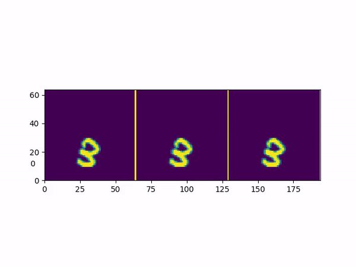

Fourier Motion Estimation and Image Transformation Source code
--------------------------------------------------------------------------------------------------------------------

This repository contains the source code for the paper Object-centered Fourier Motion Estimation
and Image Transformation for Video Prediction [ESANN 2020, to appear]. Please take a look at the 
paper to learn more about the underlying math.

###### Image registration:
Pytorch_registration module 'util/pytorch_registration.py' contains code to estimate image translation and rotation.
The pytorch implementation relies on phase correlation for translation and log-polar phase correlation for rotation.
It is based on the numpy code available at https://www.lfd.uci.edu/~gohlke/code/imreg.py.html. 

###### Image transformation:
The 'util/rotation_translation_pytorch.py' module ships my implementation of the three pass frequency domain
approach to image translation and rotation, which is inspired by the description in 
https://tspace.library.utoronto.ca/bitstream/1807/11762/1/MQ28850.pdf.
I would like to thank Hafez Farazi for helping me debug the log-polar transformation pytorch code.

###### RNN cell:
The estimation, correction and prediction network is implemented as a recurrent cell. Its code 
can be found at 'cell/registration_cell.py'.

###### Reproduction:
To reproduce results from the paper, adjust the parameters as described in the paper and run 'train_reg_gru.py'.
For an example tensorboard logfile visualization run 'tensorboard --logdir=sample_run'.

###### Dependencies:
This project has been developed using pytorch version 1.4.0 and Tensorboard 2.1.0 on Nvidia Titan Xp cards
using late 2019 ubuntu releases.

###### Known Issues:
The rotations are currently measured with respect to the image center. Working with the object center instead will 
simplify things. The recurrent cell is presently only able to deal with small rotations in a stable way.
Translation and rotation registration is limited to pixel level accuracy. 

###### Related code:
If you find this project interesting the repositories at https://github.com/AIS-Bonn/FreqNet 
and https://github.com/daniilidis-group/polar-transformer-networks may also be relevant for your work.

###### Citation:
Should you find this work helpful please cite:
```
@inproceedings{wolter2020Object,
     author = {Wolter, Moritz and Yao, Angela and Behnke, Sven},
      title = {Object-centered Fourier Motion Estimation and Segment-Transformation Prediction},
      booktitle={28th European Symposium on Artificial Neural Networks, 
                 Computational Intelligence and Machine Learning},
      year={2020}
}
```

###### Acknowledgements:
We thank DFG project YA 447/2-1 (Research Unit FOR 2535) and the
Singapore Ministry of Education Academic Research Fund Tier 1 for funding. Moritz would
like to thank Hafez Farazi for coding and Michael Weinmann writing support.

###### Example video:
The gif below shows the true video our estimation prediction correction and a vanilla GRU predictions.
Please note that this is not the best possible GRU-performance, the video is meant as a conceptual illustration.   


